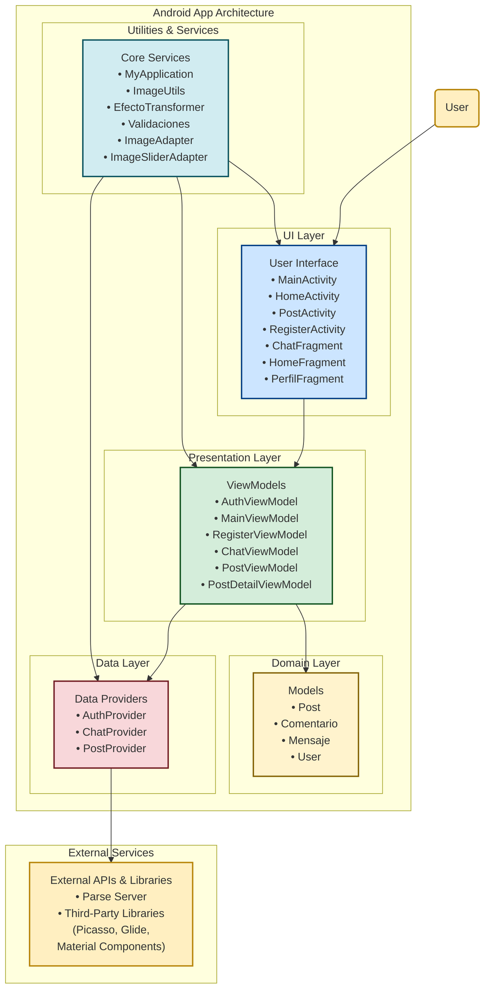

# MovilTPI

MovilTPI es una aplicación móvil Android que permite a los usuarios compartir experiencias de viaje e interactuar a través de publicaciones, comentarios y chats en tiempo real. Utiliza Parse Server como backend para la gestión de datos y autenticación de usuarios.

## Características Principales

-   **Autenticación**: Registro e inicio de sesión con correo electrónico y contraseña.
-   **Publicaciones (Posts)**: Creación, visualización y filtrado de publicaciones con título, descripción, categoría, duración y presupuesto.
-   **Comentarios**: Los usuarios pueden comentar en las publicaciones.
-   **Chats en Tiempo Real**: Comunicación directa entre usuarios mediante mensajes, con notificaciones en tiempo real utilizando Parse LiveQuery y polling como respaldo.
-   **Gestión de Imágenes**: Subida y visualización de imágenes de perfil y publicaciones, optimizadas con Picasso y Glide.
-   **Filtros**: Filtrado de publicaciones por categoría y orden (recientes o populares).
-   **Perfil de Usuario**: Visualización y edición de datos personales, incluyendo foto de perfil y publicaciones asociadas.
-   **Interfaz Moderna**: Diseño responsive con Material Design y componentes personalizados como RecyclerView, BottomNavigationView y FloatingActionButton.

## Tecnologías Utilizadas

-   **Lenguaje**: Java
-   **Framework**: Android SDK
-   **Backend**: Parse Server (hosteado en Back4App)
-   **Bases de Datos**: Parse Database
-   **Librerías Principales**:
    -   Parse SDK
    -   Picasso y Glide para manejo de imágenes
    -   ShapeOfView para vistas personalizadas
    -   Material Components for Android para diseño de interfaz
    -   androidx (AppCompat, RecyclerView, ViewModel, LiveData, etc.)
    -   androidx.viewpager2 (deslizadores de imágenes)

## Requisitos Previos

-   Android Studio (versión recomendada: 2023.1.1 o superior)
-   JDK 11
-   Cuenta en Back4App para configurar el backend
-   Emulador Android o dispositivo físico con Android 9.0 (API 28) o superior

## Instalación

1.  **Clonar el repositorio**:

    ```bash
    git clone https://github.com/ULP-UGD/MovilTPI.git
    cd MovilTPI
    ```

2.  **Abrir en Android Studio**:
    -   Abre Android Studio y selecciona "Open an existing project".
    -   Navega hasta la carpeta clonada y selecciona el proyecto.

3.  **Configurar el backend**:
    -   Crea una aplicación en Back4App.
    -   Copia el Application ID, Client Key y Server URL generados.
    -   Abre el archivo `res/values/strings.xml` y actualiza los siguientes valores:

    ```xml
    <string name="back4app_server_url">[https://parseapi.back4app.com/](https://parseapi.back4app.com/)</string>
    <string name="back4app_app_id">TU_APP_ID</string>
    <string name="back4app_client_key">TU_CLIENT_KEY</string>
    ```

>[!NOTE]
> Para que funcione correctamente el chat, debes configurar lo siguiente en Cloud Code en Back4App
>
>Debes agregar el siguiente codigo en cloud/main.js y luego hacer clic en Deploy
>
> ```js
> Parse.Cloud.beforeSave('Messages', async (request) => {
>   const message = request.object;
>   if (!message.existed()) {
>     const receiverId = message.get('receiver').id;
>
>     const query = new Parse.Query(Parse.Installation);
>     query.equalTo('user', { __type: 'Pointer', className: '_User', objectId: receiverId });
>
>     const payload = {
>       data: {
>         alert: `New message from ${message.get('sender').get('username')}`,
>         title: 'New Message',
>         messageId: message.id,
>         senderId: message.get('sender').id
>       },
>     };
>
>     try {
>       await Parse.Push.send({
>         where: query,
>         data: payload
>       }, { useMasterKey: true });
>     } catch (error) {
>       console.error('Error while sending push notification', error);
>     }
>   }
> });
>
> Parse.Cloud.beforeSave(Parse.User, async (request) => {
>   const user = request.object;
>
>   // Crear un ACL público
>   const acl = new Parse.ACL();
>   acl.setPublicReadAccess(true); // Permite lectura pública
>
>   // Aplicar el ACL al usuario
>   user.setACL(acl);
> });
> ```

4.  **Sincronizar dependencias**:
    -   Haz clic en "Sync Project with Gradle Files" en Android Studio para descargar todas las dependencias.

5.  **Ejecutar la aplicación**:
    -   Conecta un dispositivo Android o inicia un emulador.
    -   Haz clic en "Run" en Android Studio.

## Uso

-   **Inicio de sesión o registro**: Al abrir la aplicación, inicia sesión con un usuario existente o regístrate con un nuevo correo y contraseña.
-   **Explorar publicaciones**: En la pantalla principal (HomeActivity), verás una lista de publicaciones. Usa el botón de filtros para personalizar la vista.
-   **Crear una publicación**: Haz clic en el botón flotante (FAB) en la pantalla principal para crear un nuevo post. Completa los campos y sube imágenes si lo deseas.
-   **Chat**: Navega a la sección "Chats" desde el menú inferior, selecciona un usuario y comienza a enviar mensajes.
-   **Perfil**: Accede a tu perfil desde el menú inferior para ver tus publicaciones y datos personales.

## Estructura del Proyecto
```
MovilTPI/
├── app/
│   ├── src/
│   │   ├── main/
│   │   │   ├── java/com/example/moviltpi/
│   │   │   │   ├── core/              # Clases base y utilidades
│   │   │   │   │   ├── models/        # Modelos de datos (Post, User, Comentario, Mensaje)
│   │   │   │   │   ├── utils/         # Utilidades (ImageUtils, Validaciones, etc.)
│   │   │   │   │   └── MyApplication.java  # Configuración inicial de Parse
│   │   │   │   ├── features/          # Funcionalidades de la app
│   │   │   │   │   ├── auth/          # Autenticación (Login, Registro)
│   │   │   │   │   ├── chat/          # Sistema de chat
│   │   │   │   │   ├── posts/         # Gestión de publicaciones
│   │   │   │   │   └── users/         # Gestión de perfiles
│   │   │   ├── res/                   # Recursos (layouts, drawables, valores)
│   │   │   └── AndroidManifest.xml    # Configuración de la app
│   └── build.gradle.kts               # Configuración de Gradle
└── README.md                          # Este archivo
```



>[!NOTE]
>
>Este diagrama es una modificacion del obtenido en https://gitdiagram.com/ulp-ugd/moviltpi
